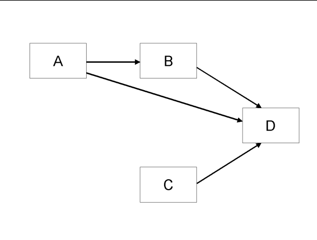

## Introduction

We ask that authors follow these basic guidelines when submitting to ICIS. In essence, you should format your paper exactly like this document. The easiest way to use this template is to replace the placeholder content with your own material. The template file contains specially formatted styles (e.g., ``Normal``, `Heading`, `Bullet`, `References`, `Title`, `Author`, `Affiliation`) that are designed to reduce the work in formatting your final submission.

@WebsterWatson2002

As shown in @fig-research_model, ...

{#fig-research_model width=300px}

## More Information

You can learn more about controlling the appearance of Word output here: <https://quarto.org/docs/output-formats/ms-word.html>

# References